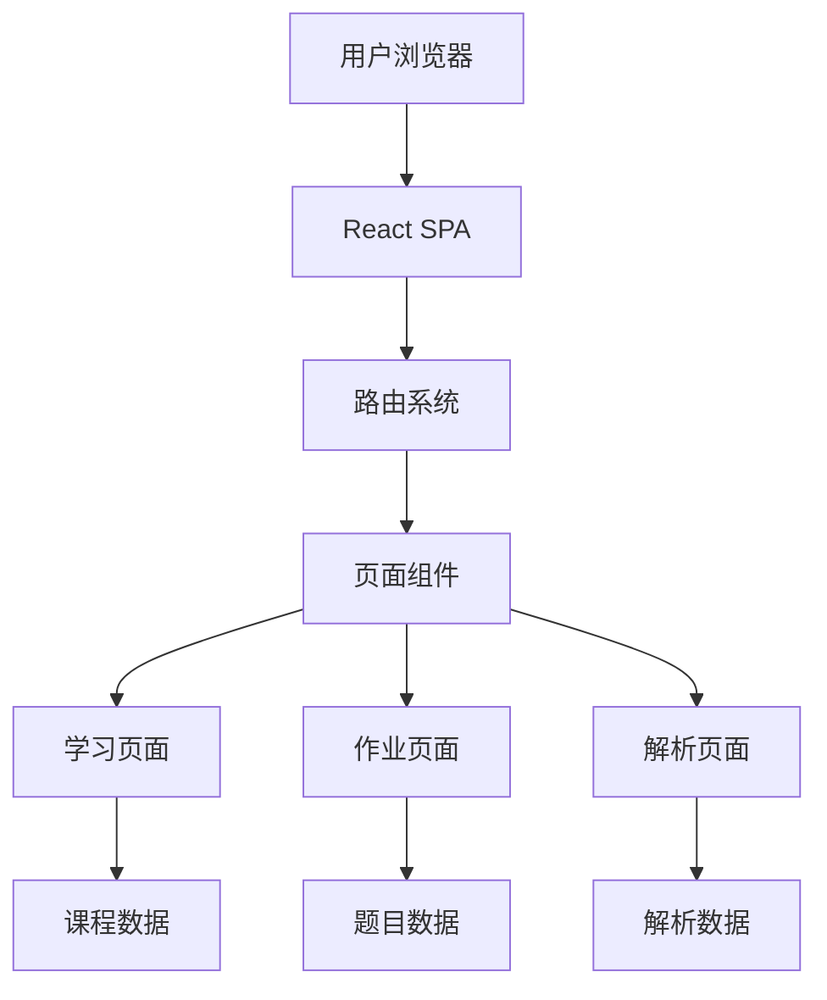

## 1. Architecture Design
纯前端单页应用架构，使用 React + TypeScript + Vite 构建，无需后端服务。



## 2. Technology Description
- **Frontend**: React@18 + TypeScript + Vite + Tailwind CSS
- **State Management**: Zustand
- **Code Editor**: react-simple-code-editor + prismjs
- **Icons**: lucide-react
- **Charts**: recharts (用于数据可视化展示)
- **Initialization Tool**: vite-init

## 3. Route Definitions
| Route | Purpose |
|-------|---------|
| / | 首页 - 课程列表和介绍 |
| /course/:id | 课程学习页 - 展示课程内容 |
| /course/:id/homework | 课后作业页 - 完成题目 |
| /course/:id/solution | 答案解析页 - 查看解析 |

## 4. Data Structure
### 4.1 课程数据结构
```typescript
interface Course {
  id: string;
  title: string;
  description: string;
  icon: string;
  content: CourseContent[];
  homework: Homework;
  solution: Solution;
}

interface CourseContent {
  title: string;
  sections: ContentSection[];
}

interface ContentSection {
  title?: string;
  type: 'text' | 'code' | 'image' | 'chart';
  content: string;
}
```

### 4.2 作业数据结构
```typescript
interface Homework {
  multipleChoice: Question[];
  trueFalse: Question[];
  coding: CodingQuestion;
}

interface Question {
  id: number;
  question: string;
  options?: string[];
  answer: string | boolean;
  explanation: string;
}

interface CodingQuestion {
  title: string;
  description: string;
  starterCode: string;
  testCases: TestCase[];
  solutionCode: string;
  explanation: string;
}

interface TestCase {
  input: string;
  expectedOutput: string;
}
```

### 4.3 答案解析数据结构
```typescript
interface Solution {
  multipleChoice: QuestionSolution[];
  trueFalse: QuestionSolution[];
  coding: CodingSolution;
}

interface QuestionSolution {
  id: number;
  correctAnswer: string | boolean;
  explanation: string;
  keyPoints: string[];
}

interface CodingSolution {
  solutionCode: string;
  explanation: string;
  keyPoints: string[];
}
```

## 5. Component Structure
```
src/
├── components/
│   ├── Navbar.tsx          # 导航栏
│   ├── CourseCard.tsx      # 课程卡片
│   ├── CodeEditor.tsx      # 代码编辑器
│   ├── QuestionCard.tsx    # 题目卡片
│   └── ParticleBg.tsx      # 粒子背景
├── pages/
│   ├── Home.tsx            # 首页
│   ├── CourseLearning.tsx  # 课程学习页
│   ├── Homework.tsx        # 作业页
│   └── Solution.tsx        # 解析页
├── data/
│   └── courses.ts          # 课程数据
├── store/
│   └── useStore.ts         # Zustand状态管理
├── App.tsx
└── main.tsx
```
