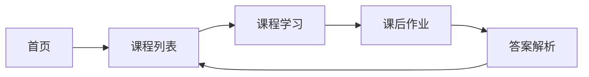

## 1. Product Overview
数据分析技术学习平台 - 面向商务数据分析与应用专业学生的纯前端学习网站，提供完整的数据分析课程体系与互动学习体验。

## 2. Core Features

### 2.1 User Roles
| Role | Registration Method | Core Permissions |
|------|---------------------|------------------|
| Student | None (纯前端) | 浏览课程、学习内容、完成作业、查看解析 |

### 2.2 Feature Module
1. **首页**: 课程介绍、导航、课程列表
2. **课程学习页**: 课程内容展示、知识点学习
3. **课后作业页**: 选择题、判断题、代码编程题
4. **答案解析页**: 作业答案解析、知识点总结

### 2.3 Page Details
| Page Name | Module Name | Feature description |
|-----------|-------------|---------------------|
| 首页 | Hero区 | 网站标题、副标题、科技风动画 |
| 首页 | 课程列表 | Python、数据来源与类型、数据采集、数据清洗、数据可视化 |
| 课程学习页 | 课程内容 | 知识点展示、代码示例、图表展示 |
| 课后作业页 | 选择题 | 10道选择题，带选项选择 |
| 课后作业页 | 判断题 | 10道判断题，选择正确或错误 |
| 课后作业页 | 代码编程题 | 在线代码编辑器、运行测试 |
| 答案解析页 | 答案展示 | 正确答案、详细解析、知识点回顾 |

## 3. Core Process
学生访问网站 → 浏览课程列表 → 选择课程学习 → 学习课程内容 → 完成课后作业 → 查看答案解析

## 4. User Interface Design
### 4.1 Design Style
- **Primary Colors**: 深蓝色(#0f172a)、科技蓝(#3b82f6)、霓虹青(#06b6d4)
- **Accent Colors**: 亮绿色(#10b981)、警示红(#ef4444)
- **Button Style**: 圆角矩形、霓虹光效、悬停动画
- **Font**: 标题使用 Orbitron，正文字体使用 JetBrains Mono
- **Layout**: 卡片式布局、网格系统、科技感线条装饰
- **Icon Style**: 线性图标、霓虹边框、科技元素
- **Background**: 深色渐变、网格背景、粒子动画效果

### 4.2 Page Design Overview
| Page Name | Module Name | UI Elements |
|-----------|-------------|-------------|
| 首页 | Hero区 | 深色背景、霓虹文字、粒子效果、渐变装饰 |
| 首页 | 课程列表 | 卡片式布局、hover效果、进度条显示 |
| 课程学习页 | 内容区 | 分块展示、代码高亮、图表嵌入 |
| 课后作业页 | 题目区 | 题目卡片、选项高亮、提交按钮 |
| 答案解析页 | 解析区 | 正确/错误标记、详细解析、知识点卡片 |

### 4.3 Responsiveness
- 桌面端优先设计，支持平板和移动端自适应
- 响应式网格布局，断点: 1024px, 768px, 480px
- 触摸交互优化

### 4.4 Animation Effects
- 页面加载时的渐入动画
- 卡片悬停时的上浮和发光效果
- 粒子背景动画
- 按钮点击时的波纹效果
